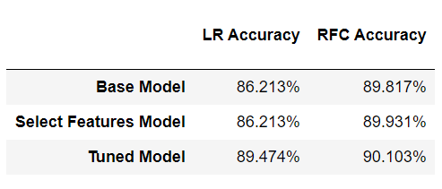

### Final-Project---Demystifying-ML

# Machine Learning - Exoplanet Exploration

For my ML Final project I will be taking a deep dive into the exoplants project, that was introduced in WK 21.

By definition Machine Learning (ML) is the study of computer algorithms that can improve automatically through experence
and by the use of data. This study is seen as a part of Artificial Intelligence (AI).

ML can also be seen as the use and development of computer systems that are able to learn and adapt without following explicit instructions,
by isint algorithims and statitical models to analyze and draw inferences from patterns in data

## Background

Over a period of nine years in deep space, the NASA Kepler space telescope has been out on a planet-hunting mission to discover hidden planets outside of our solar system.

For this final project Machine learning models were created to classify candidate exoplanets from the provided raw dataset, including all of its 40 sets of data (Features).

- - -
## Models
### Two Techniques selected
- Logistic Regression (LR)
- Random Forest Classifier (RFC)

### Model Design Approach
- Build a base model using the original dataset and all its 40 features.
- Use the base model to evaluate feature importance, and filter the data to include relevant features only.
- Build a second model (select features model) using the filtered data.
- Tune the model parameters using *GridSearchCV*.
- Build the final model using the tuned parameters. 

## Model Comparison
The RFC model was the more accurate of the two by a small margin.

## Conclusions
Evidently, given the relatively high accuracy of the RFC model, I believe it to be a reasonable predictor of exoplanet candidacy. However, a model leveraging deep learning techniques might prove superior.
